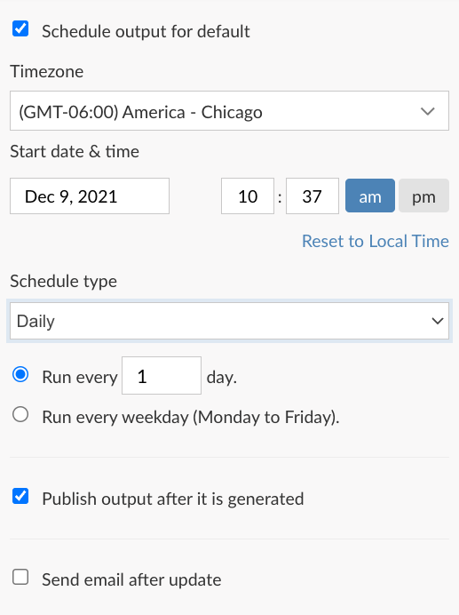
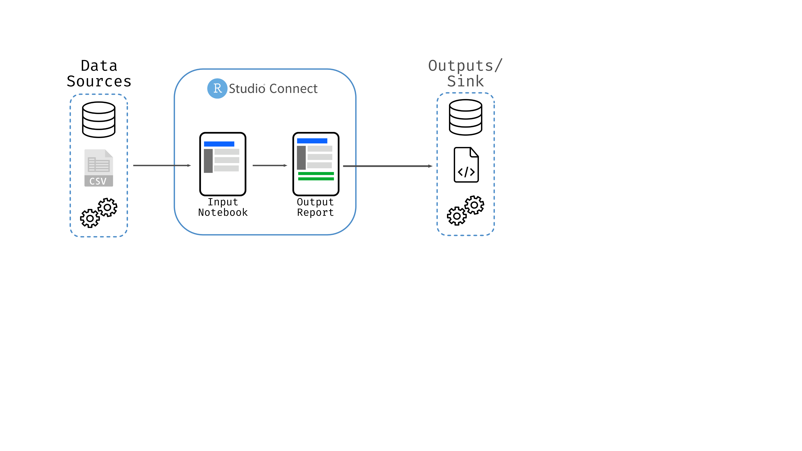

```{r setup, include = FALSE}
library(tidyverse)
library(palmerpenguins)
library(bbplot)

knitr::opts_chunk$set(eval = TRUE, fig.retina = 2)
```

class: title-slide, left, top

# `r rmarkdown::metadata$title`<br> `r rmarkdown::metadata$subtitle`

### `r rmarkdown::metadata$author`

#### `r Sys.Date()`

<br>

<span style='color:white; font-size:110%;'>Slides: [colorado.rstudio.com/rsc/automate](https://colorado.rstudio.com/rsc/automate)</span>  

<span style='color:white; font-size:110%;'>Code: [github.com/jthomasmock/connect-automation](https://github.com/jthomasmock/connect-automation)</span>  

<span style='color:white;'>Slides released under</span> [CC-BY 2.0](https://creativecommons.org/licenses/by/2.0/)&nbsp;&nbsp;`r fontawesome::fa("creative-commons", "white")``r fontawesome::fa("creative-commons-by", "white")` ]   

<div style = "position: absolute;top: 0px;right: -90px;"></img></div>

---

layout: true

<div class="my-footer"><a href='https://colorado.rstudio.com/rsc/automate'>https://colorado.rstudio.com/rsc/automate</a></div>

---

### Howdy, and welcome to the RStudio's Data Science Live!


- Customer Enablement Lead at RStudio

---

.pull-left[

```{r, echo = FALSE, out.width="50%", fig.alt="Alex Gold's headshot"}
knitr::include_graphics("https://alexkgold.space/images/me.png")
```

- Alex Gold, Solutions Engineering Manager at RStudio
- Created the [Bike Share example](https://solutions.rstudio.com/example/bike_predict/)

]

--

.pull-right[


```{r, echo = FALSE, out.width="50%", fig.alt="Katie Masiello's headshot"}
knitr::include_graphics("https://media-exp1.licdn.com/dms/image/C5603AQGfPqC1dzr1zQ/profile-displayphoto-shrink_800_800/0/1556947352539?e=1644451200&v=beta&t=r9feBsP9cgPQ2uG4muAGy7399ptUd4P4r_h8Rn3uvRU")
```

- Katie Masiello, Customer Success Manager at RStudio
- Created the [`pointblank` demo content](https://github.com/kmasiello/pointblank_demo)

]

---

### RStudio Connect

```{r, echo = FALSE, out.width="60%", fig.align='center'}
knitr::include_graphics("https://d33wubrfki0l68.cloudfront.net/e745d5d4a555874675c72cc2839f192abd0ffa06/0d075/assets/img/rsc_hero_right-v4.png")
```

---

### Notebooks on RStudio Connect

.pull-left[

You can automate the execution of arbitrary R and Python code with notebooks

- RMarkdown for native R code  
- Jupyter for native python code  

]

--

.pull-right[

```{r, echo = FALSE, out.width="70%", fig.alt="a screenshot of Connect's scheduling GUI"}

```

]

---

### Why notebooks?

- Achieve primary goal and useful side-effects along with separate outputs (RDS, Pickle file, CSV, plots, etc)  

--

- Also generate a rich self-contained output/report, ie the notebook *IS* the data product  

- Shareable/hostable, easy to read, self-documenting output as a report, easy to use  

--

- RMarkdown and Jupyter can display the code used to execute along with all of the embedded outputs inline  

--

- RMarkdown scheduled on RStudio Connect can also generate additional robust side-effects like emails with `blastula`

---

### Why RStudio Connect?

- R and Python content (along with SQL/Spark/etc)  

- Environment isolation (ie packages/libraries in R/Python)  

- Enterprise-grade authentication  

- Push-button deployment or directly from Git/CI-CD  

- Designed as a Data Science tool rather than just a generic tool  

- Re-execute R/Python code on demand OR on a schedule for automation of tasks  

---

### What type of Automation

All sorts of automation, across a spectrum of needs:

--

- Automated data updates/ETL  

--

- Automated report updates and delivery  

--

- Automated model training/updates  

--

- Automated email delivery with warnings/updates  


---
class: center, middle, inverse

# Automated Data Updates

---

### Packages

- `rvest` and `httr` for web data
- `dbplyr`/`sparklyr` for SQL and Spark connections
- `pins` for files, data or arbitrary R objects

---

### `pins`

> The pins package publishes data, models, and other R objects, making it easy to share them across projects and with your colleagues.

--

Use a RStudio Connect as a board, and write a tidy data frame to it

```{r, eval = FALSE}
board <- board_rsconnect()
#> Connecting to RSC 1.9.0.1 at <https://connect.rstudioservices.com>
board %>% pin_write(tidy_sales_data, "sales-summary", type = "rds")
#> Writing to pin 'hadley/sales-summary'
```

--

Retrieve it back inside an automated RMarkdown report, or any other R context

```{r, eval = FALSE}
board <- board_rsconnect()
board %>% pin_read("hadley/sales-summary")
```

---

### `pins`

While many people use `pins` exclusively as a way to share data across a team, it can also upload/download arbitrary R objects as a RDS. This means that model objects can be saved as a `pin`, versioned, and accessed downstream.

--

`pins` are not limited to JUST RStudio Connect, can also connect to AWS, Azure, GCP, local folders, Kaggle, OneDrive/Sharepoint, or an arbitrary URL. One benefit of using RStudio Connect as the destination is the tight coupling between your data products and the data, and easy to manage credentials.

--

`pins` natively can read/write JSON, CSV, RDS, Arrow, or qs files. Any other files would need to be used with `pin_upload()`/`pin_download()` and a respective reading call. IE you can use `pin_download()` + `arrow::read_parquet()` to download and read a parquet file.


---

### `dbplyr`

The same easy to use `dplyr` syntax, but operating against a SQL database! `dbplyr` translates R code into SQL code behind the scenes. 

This allows for reading from AND writing back to a database with R. RMarkdown can also accept raw SQL chunks if you'd prefer to go that route as well.

---

### `dbplyr` or `sparklyr`

Use `dplyr` against SQL databases or `sparklyr` against Spark clusters

```{r, eval = FALSE}
con <- DBI::dbConnect(RMySQL::MySQL(), 
  host = "database.rstudio.com",
  user = "hadley",
  password = rstudioapi::askForPassword("Database password")
)

flights_db <- tbl(con, "flights")
```

--

```{r, eval = FALSE}
# execute a query
flights_db %>% 
  group_by(dest) %>%
  summarise(delay = mean(dep_time))
```


---

### Accessing web data

If you are querying data from an API, you can use [`httr`](https://httr.r-lib.org/) to structure and send curl queries, or if a GraphQL API you could instead use [`ghql`](https://ropensci.org/blog/2020/12/08/accessing-graphql-in-r/) from ROpenSci.

`rvest` provides a rich syntax for programatically accessing data embedded in HTML websites or simply scraping context/metadata.

---

### Automated data updates or ETL

- ETL = Extract Transform Load  

- **Extract** data from:  

  - Arbitrary database, Business/customer/marketing data, sensor or machine data, API data, or other heteregenous data sources  
  
- **Transform** the data into a useful/standard format, so it's ready for downstream analysis or use in downstream systems  
  
- **Load** the data from intermediary format into longterm store, ie a database or possibly a data warehouse if flat files  
  
---

### ELT (Extract Load Transform)

**Extract** the raw data itself, and **Load** into some storage area. Downstream applications or separate processes then **Transform** or otherwise process/utilize the data.

Commonly used in Data Lakes (ie raw data, semi-structured)

--

R has rich support for Cloud data sources: 

- To AWS/S3 via [`aws.s3`](https://github.com/cloudyr/aws.s3) or [`paws` S3](https://paws-r.github.io/docs/s3/)  
- To Azure via [`AzureStor`](https://github.com/cloudyr/AzureStor)  
- To GCP via [`googleCloudStorageR`](https://github.com/cloudyr/googleCloudStorageR)  
- The `pins` package has wrappers for all of the above as well!  

--

Python has rich support via Cloud APIs/CLIs/SDKs (ie `Boto3` for AWS, etc)

---

### `arrow`

The Apache Arrow project provides ability to efficiently read/write files to compressed formats like parquet, along with CSV, feather, arrow, or ipc formats

--

Exceptionally useful for working with data warehouses/data lakes or the writing/structuring of individual data files, especially as `arrow::write_dataset()` can also natively partition data.

--

Note that `arrow` also gives ability to read/write parquet files which are very efficient on disk (ie small file sizes) and fast to read. Smaller files are "cheaper" to move and store, and are commonly used in datalakes.

---

### `pointblank` for data validation

.pull-left[
> With the `pointblank` package it’s really easy to methodically validate your data whether in the form of data frames or as database tables.

My colleague Katie Masiello has a wonderful demo with code on [`pointblank`](https://github.com/kmasiello/pointblank_demo) and a great homepage [overview](https://colorado.rstudio.com/rsc/pointblank/)!


]


.pull-right[

```{r, echo = FALSE, out.width="70%", fig.alt="Logo for Pointblank R package, it is a hex logo gif with a green line that scans over cells in a grid"}

knitr::include_graphics("https://raw.githubusercontent.com/rich-iannone/pointblank/main/man/figures/logo.svg")
```

]

---

### All together now

```{r, echo=FALSE, out.width="115%", fig.alt="A diagram of RStudio Connect taking raw data sources, executing R/Python code in a notebook and generating side effects/outputs to a separate data store"}

```

---

### A more complex [end-to-end example](https://colorado.rstudio.com/rsc/bike-share/) 

```{r, echo = FALSE, out.width="85%", fig.alt = "A Diagram of a complex data science pipeline including automation of model training, data cleaning, accessing an API and a database"}
knitr::include_graphics("https://solutions.rstudio.com/example/images/bike-predict/bp-overview.png")
```

---
class: inverse, middle, center

# Automated Reporting

---

### Automated reporting

- RStudio Connect allows for scheduling RMarkdown/Jupyter notebooks, which can be used as a "report"  

--

- Reports have many different purposes  

  - A report intended for the data scientist or their team  
  
  - A report for a business user or an executive  
  
  - Some combination of the two  

--

- All are valid, and difference arises in **what is shown**, the ultimate **purpose of said report**, and the **persona** it is created for 

---

### Reports for data scientists

.pull-left[

- Capture the code and the output in a single document  
- Report itself is a "side effect", the primary purpose is the automation of the task  
- While the report is a _side effect_ it can still be very useful!  
- Differences between the report itself and it's outputs/sinks

]

--

.pull-right[

- ETL or ELT work, ie data cleaning and preparation  
- Model training or batch scoring  
- Data imputation or validation  

]

---

### Examples from the Bikeshare

Data aggregation and ETL

- [ETL Cleaning](https://colorado.rstudio.com/rsc/content/3b26e931-1ebe-40d1-a082-86a074f197c7/ETL_clean_raw.html) using the `tidyverse` and `httr` to access an API  
- [ETL into database](https://colorado.rstudio.com/rsc/content/835bebd4-345f-4c71-8c82-c5dc63f7ceb9/ETL_raw_into_db.html) using `dbplyr` and `pins`  

--

Model Training and Batch Scoring

- [Train xgboost model](https://colorado.rstudio.com/rsc/connect/#/apps/00d64eed-1d3c-4f27-8f71-0a0cd6435540/access/3181)  
- [Batch scoring with trained model](https://colorado.rstudio.com/rsc/connect/#/apps/4a3dbea5-482d-4091-a0c2-3068d5e1ceaa/access/3251)  

---

### Reports for Business Users/Executives

Now reports going out to non-technical colleagues are more about packaging up your data/story/visualization and less about showing the code.

--

So how do you make a report that fits your company style? One that is attractive AND useful?

---

### RMarkdown Themes with `bslib`

> The bslib R package provides tools for customizing Bootstrap themes directly from R, making it much easier to customize the appearance of Shiny apps & R Markdown documents. bslib’s primary goals are:
> 
> - Make custom theming as easy as possible.
> - Custom themes may even be created interactively in real-time.
> - Also provide easy access to pre-packaged Bootswatch themes.

--

`thematic` takes `bslib` themes and applies it to plots (ie `ggplot2` and `plotly`) as well as basic tables with `DT`

---

### `bslib` + RMarkdown

.pull-left[

```r
bs_theme(
  version = version_default(),
  bootswatch = NULL,
  ...,
  bg = NULL,
  fg = NULL,
  primary = NULL,
  secondary = NULL,
  base_font = NULL,
  code_font = NULL,
  heading_font = NULL,
  font_scale = NULL
)
```

]

--

.pull-right[

```yaml
---
title: "A themed report"
output:
  html_document:
    theme:
      bg: "#F8F8F8"
      fg: "#404040"
      primary: "#4D8DC9"
      base_font:
        google: "Fira Sans"
      code_font:
        google: "Fira Mono"
---
```

]

---

### RMarkdown `distill`

Fantastic defaults but also allows for customization/custom themes with `create_theme()`.

```yaml
---
title: "Distill for R Markdown"
description: | 
  Scientific and technical writing, native to the web
output:
  distill::distill_article:
    toc: true
    toc_depth: 3
---
```

---
class: center, middle, inverse

# Emails from RStudio Connect

---

### Automated Email delivery

> The `blastula` package makes it easy to produce and send HTML email from R. 

--

Emails can be sent via SMTP (ie Gmail), but more commonly via RStudio Connect itself and the built-in mail server through your existing company email.

--

```{r, eval = FALSE}
render_connect_email(input = "email-alert.Rmd") %>%
  attach_connect_email(subject = "Important data!")
```

--

Emails in RStudio Connect live example.

---

### Conditional Execution

While emails every time a doc is rendered can be useful, sometimes you want a higher signal to noise ratio.

IE - an email sent ONLY if a criteria is met or not.

--

- Data quality suffers  
- Model predictions outside a range  
- Dataset too small  
- Whatever criteria you want to define  

---

### Conditional Execution

Basic example below, but essential workflow is just `render_connect_email()` or `suppress_scheduled_email()`

```{r connect_email, eval=FALSE}
if (max(ml_preds) >= 150) {
  render_connect_email(input = "over-prediction-alert.Rmd") %>%
    attach_connect_email(
      subject = "Warning model drifting too high!"
    )
} else {
  suppress_scheduled_email()
}
```

---

### Conditional Email

```{r, eval = FALSE}
high <- value > norm

# choose a specific EMAIL to send, always send one
email_file <- ifelse(high, "high-alert.Rmd", "basic-report.Rmd")
  render_connect_email(input = "email_file") %>%
    attach_connect_email(
      subject = "Daily value check!"
    )
```

---

### Resources

.pull-left[
- [`blastula` emails](https://pkgs.rstudio.com/blastula/reference/render_email.html) and [Custom emails](https://solutions.rstudio.com/r/blastula/conditional-example/)  
- [`pins`](https://pins.rstudio.com/articles/rsc.html)  
- [`distill` RMarkdown](https://rstudio.github.io/distill/), [`thematic`](https://rstudio.github.io/thematic/articles/auto.html#rmd), [`bslib`](https://rstudio.github.io/bslib/reference/bs_theme.html)
- [RStudio Solutions, Bike Share Example](https://solutions.rstudio.com/example/bike_predict/)  
- [Apache Arrow presentation](https://jthomasmock.github.io/bigger-data/#1)  
- [db.rstudio.com](https://db.rstudio.com/r-packages/dplyr/)  

]

.pull-right[
- [Connect Scheduling](https://docs.rstudio.com/connect/user/scheduling/)  
- [Connect and Email Customization](https://docs.rstudio.com/connect/user/rmarkdown/#r-markdown-email-customization)  
- [Connect schedule updates to `pins`](https://docs.rstudio.com/how-to-guides/users/pro-tips/pins/#schedule-updates-to-your-pin)  
- [Beyond Dashboard Fatigue webinar & content](https://github.com/rstudio/beyond-dashboard-fatigue)  
- [Rethinking Reporting with Automation webinar](https://www.rstudio.com/resources/webinars/rethink-reporting-with-automation/)  

]

### [Connect Overview](https://www.rstudio.com/products/connect/)